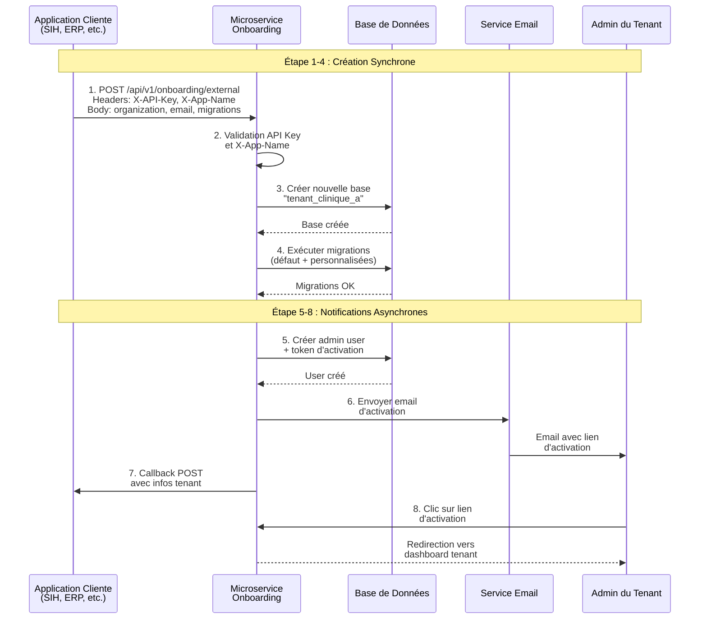
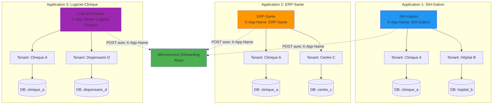
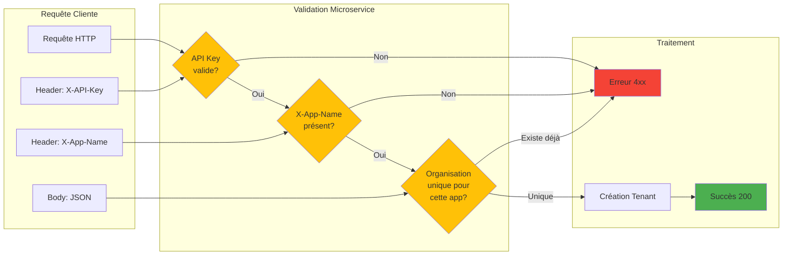
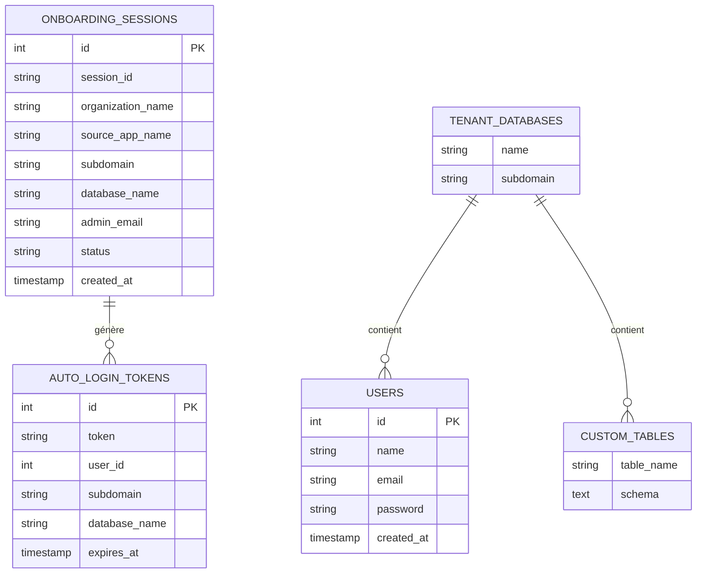
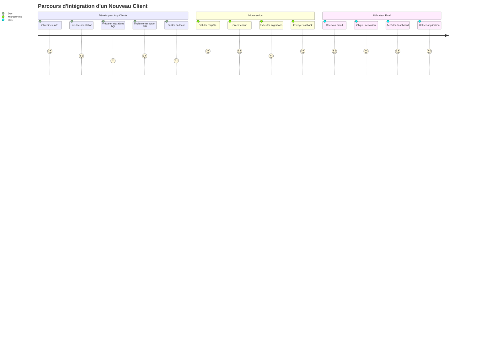

# Schémas et Diagrammes - Microservice Onboarding Akasi

Ce document contient tous les schémas visuels pour expliquer le fonctionnement du microservice d'onboarding.

---

## 📐 Schéma 1 : Architecture Générale

**Description** :
Ce schéma montre l'architecture complète du microservice avec :
- L'application cliente qui envoie les requêtes
- Le microservice avec ses composants (API Gateway, Services, Bases de données)
- Les tenants créés avec leurs bases de données isolées
- Les flux de callback et d'email

---

## 🔄 Schéma 2 : Flux d'Onboarding Complet

**Étapes détaillées** :

### Phase Synchrone (1-4)
1. **Requête initiale** : L'application cliente envoie les données de l'organisation
2. **Validation** : Le microservice vérifie les credentials et le header X-App-Name
3. **Création DB** : Une nouvelle base de données est créée pour le tenant
4. **Migrations** : Les tables par défaut + les tables personnalisées sont créées

### Phase Asynchrone (5-8)
5. **Création admin** : Un compte administrateur est créé avec un token unique
6. **Email** : Un email d'activation est envoyé à l'administrateur
7. **Callback** : Le microservice notifie l'application cliente que le tenant est prêt
8. **Activation** : L'admin clique sur le lien et accède à son espace

---

## 🏢 Schéma 3 : Isolation Multi-App

**Règles d'Isolation** :

✅ **AUTORISÉ** :
- `SIH-Gabon` peut créer "Clinique A"
- `ERP-Sante` peut AUSSI créer "Clinique A" (pas de conflit)
- `Logiciel-Clinique` peut AUSSI créer "Clinique A" (pas de conflit)

❌ **INTERDIT** :
- `SIH-Gabon` ne peut PAS créer "Clinique A" deux fois
- `ERP-Sante` ne peut PAS créer "Clinique A" deux fois

**Pourquoi c'est important** :
- Chaque application a son propre espace de noms
- Pas de collision entre différentes applications
- Permet la réutilisation du microservice par plusieurs clients

---

## 🔐 Schéma 4 : Flux d'Authentification et Sécurité

---

## 📊 Schéma 5 : Structure des Données

**Légende** :
- **Base Centrale (MySQL)** : Contient `onboarding_sessions` et `auto_login_tokens`
- **Bases Tenant** : Chaque tenant a sa propre base avec `users` et tables personnalisées

---

## 🎯 Schéma 6 : Cas d'Usage Typique

---

## 📝 Notes d'Utilisation

### Comment visualiser ces diagrammes ?

1. **Sur GitHub/GitLab** : Les diagrammes Mermaid s'affichent automatiquement
2. **VS Code** : Installer l'extension "Markdown Preview Mermaid Support"
3. **En ligne** : Copier le code Mermaid sur https://mermaid.live/

### Partager avec vos collègues

Vous pouvez :
- Exporter ce fichier en PDF (les diagrammes seront inclus)
- Partager le fichier Markdown sur votre dépôt Git
- Copier les diagrammes individuellement dans vos présentations

---

© 2026 Akasi Group - Documentation Technique
